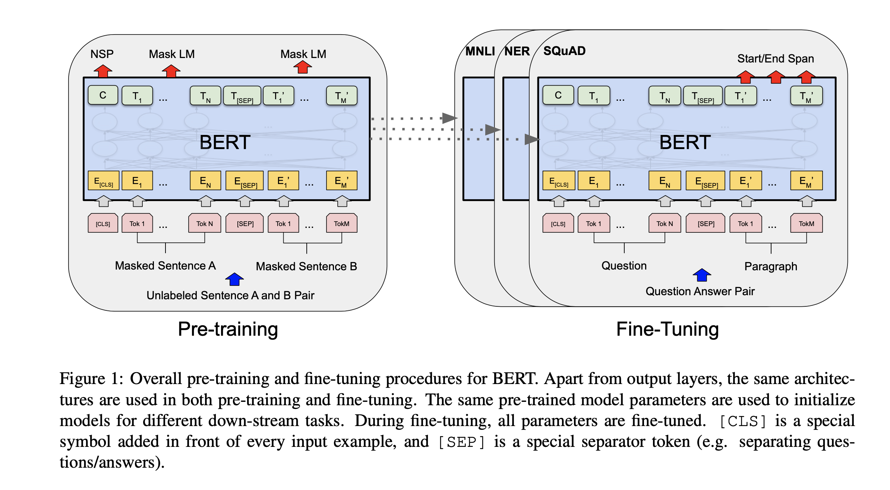
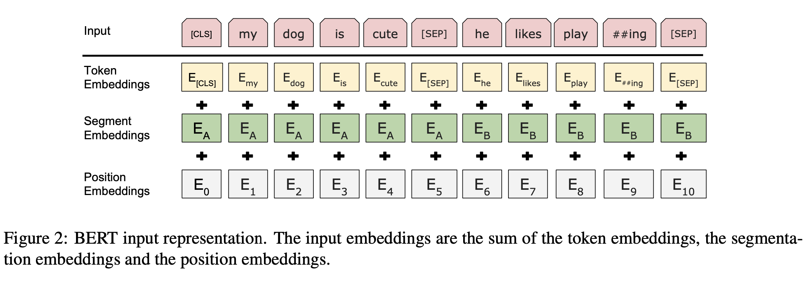

# BERT: Pre-training of Deep Bidirectional Transformers for Language Understanding

### TL;DR

* BERT improves ELMO and GPT by using the Transformer encoder as a deep bidirectional language modeling
* Two pretrained tasks are used: Masked LM (MLM) and Next Sentence Prediction (NSP)
* Same as GPT, for fine-tuned tasks including sentence pairs, they concatenate them together and use the uniform architecture
* BERT has the performance breakthrough on eight GLUE tasks 

### Motivation

* The paper borrow some ideas from ELMO and GPT, for example, using bidirectional LM, concatenating sentence pairs
* However, ELMO and GPT has some drawbacks on which BERT improves:
  * ELMO uses LSMT as bidirectional LM, which is not deep enough, and it can be shown that deep LM has a better represent ability
  * GPT uses only left-to-right attention/LM, which lacks the information from right to left, which is also significant for representation

### Methods

* Model Architecture

  * BERT uses the Transformer encoder to encode the whole text sequence

  * Since the output from Transformer encoder is a sequence of vectors, which cannot be used directly by the classifier. BERT sets the first token of each sequence as [CLS], whose output will be the representation of the whole sequence 

  * To seperate two sentences, there are two ways used at the same time in the paper: (1) add [SEP] token between sentences (2) associate each word with $E_{A}$ or $E_{B}$, which indicates that word is corresponding to sentence A or sentence B. $E$ is called _segmentation embedding_.

  * There are totally three embeddings for each token: word embedding, segementation embedding and position embedding. The word representation is the **summation** of three embeddings

    

* Pretrain Methods

  * Two tasks are used for pretraining: Masked Language Modeling, Next Sentence Prediction (NSP)
* Masked LM
  
  * BERT uses this task to capture the information between words and its context, which is word level information
  
  * Different from LSTM in ELMO, which needs to be trained using left-to-right and right-to-left LM separately, BERT uses Transformer, which integrates two LMs together since each word can attend on contexts on both its left and right. 
    * When training, there is 15% random positions are selected as masked, and using [MASK] to indicate it. When fine-tuning, there is no [MASK], to mitigate this, the paper adopts following strategies to those masked words: (1) use [MASK] for 80% of the time (2) substitute it with a random word for 10% of the time (3) keep the original word for 10% of the time
    * The task is to predict the original masked word using the final hidden states and the MLP classifier. **This task is the same for all three masked methods mentioned above**. 
  * Next Sentence Prediction

    * This task is to capture the relationship between two sentences, which also a indication of the hierachical structure in the natural languages
  * The task tends to predict whether sentence A is the next sentence of sentence B, similar to negative sampling, but k=1
    * Note that in words in this NSP task can also be randomly masked
  * **Note** that in the pretraining, MLM and NSP task are used together, which means the pretraining loss is the sum from these two tasks and backpropagates once. (_Here, one interesting question is that if we do MLM when the sentence pair is not from the continuous document, which means the next sentence is sampled randomly, MLM will attend on words in this unrelated sentence. Does it make BERT give very high weights on the words in the sentence where [MASK] is, and will ignore the other one anyway, no matter it is from the continuous or not._)
  * The paper also claims that using document-level pretraining dataset is better than the shuffled sentence level ones. I guess the reason is that it enables BERT to exploit sentence relationship

* Fine-tune Methods

  * Due to the uniform architecture of BERT, which can be used for a single sentence and also pairs of sentences, BERT can be easily adapted to downstream NLP tasks with concatenated sentences
  * Note that in the paper, all parameters of the pretrained BERT will be fine-tuned
  * When fine-tuning on the single-sentence task, such as text classfication, the input is going to be all padded words for the second sentence. Thus, we don't need to do any modification for the pretrained architecture. 

### Conclusion

* From the ablation study, the paper points out several conclusions
  * NSP pretraining task and right-to-left LM are necessary for BERT performance on all tasks
  * Downstream fine-tuning tasks especially those with small training samples benefits from the pretrained model with the large number of parameters, which has powerful representation
  * BERT has a very power representation ability. Even using the fixed feature from one inner layer and uses a BiLSTM to make classification on NER task, it can achieve similar results with the SOTA models