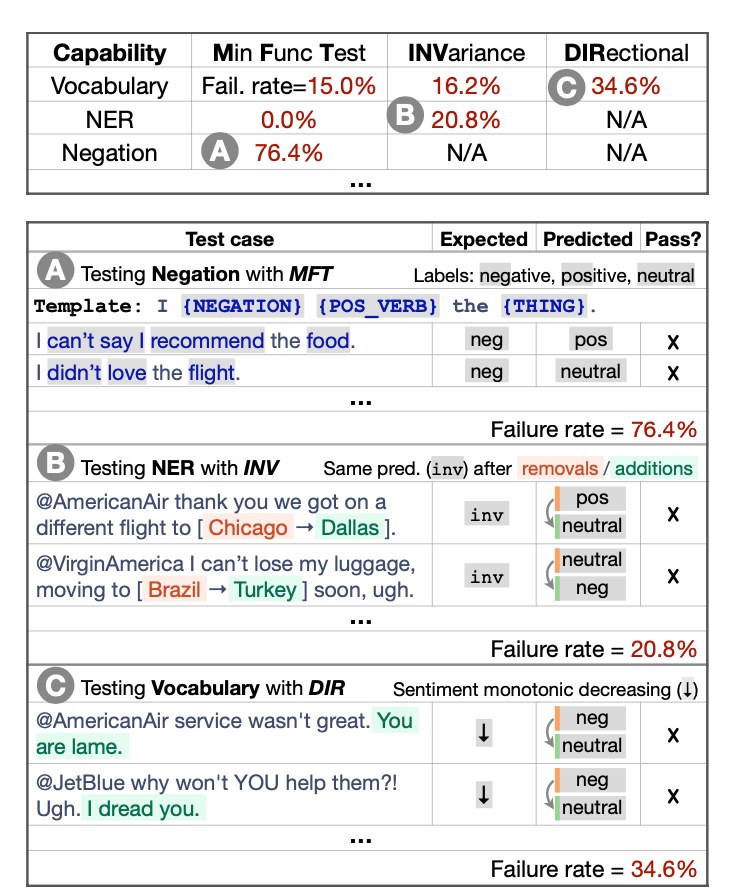

# Beyond Accuracy: Behavioral Testing of NLP Models with CHEKLIST

### TL;DR

* Previous held-out testing sets and single evaluation metrics are not comprehensive enough to test NLP models and cannot point out the specific bugs.
* The paper proposed a comprehensive checklist to test 10 abilities of each NLP model to keep it as general as possible. 
* The checklist was tested on commertial sentiment analysis tools and research models to verify its usefulness and flexibility, and was proved to be able to benefit both experienced and unexperienced system testers.

### Motivations

* Ususally, NLP models are always evaluated on the hold-out test set which is probabily from the same dataset with the training/validation sets, which may contain the same bias. Thus, the model is not general and the model is always overestmated.
* The usual single evaluation aggregated metrics cannot give deployers or testors any hint where the bugs are. 
* Current solutions are only based on a specific NLP tasks, which cannot be adapted to all tasks.

### CHECKLIST

The checklist is a matrix, whose columns are test types, rows are capacities and cell values are faliure rates. 

* Test types:
  * Minimum Functionality test (MFT): **simple** examples to check a behavior within a capability we want to test.
  * Invariance test (INV): robustness check, to apply label-preserving perturbations to inputs and expect the model prediction remain the same. 
  * Directional Expectation test (DIR): similar to INV, but we can change the part of sentences which the label will change in a certain way (e.g. going to more positive or negative). 
* Capacities: 10 capacities are suggested to test: Vocabulary + POS, Taxonomy, Robustness, NER, Faireness, Temporal, Negation, Coreference,  Semantic Role Labeling and Logic.
* How to generate Test cases: 
  * Users can both generate from scratch or modify the original dataset
  * The paper (checklist) provides generalized templates which can help generalize tons of specific testing texts
  * To allievate users' burden, the author also provides RoBERTa based suggestions for the fill-in-blank in templates.

* The example of CHECKLIST is as follows:

  

### Proof

* To prove the usefulness of the checklist, the paper checked on three commercial models of sentiment anaylsis and also BERT-based models from research. For both aspects, they found many shortcommings of the model and explain where they are. 
* The paper verified its simplication by having positive feedbacks from both experienced and unexperienced users. 

### My questions

* Who are the targeted audience of this paper? Deployers in industry or researchers? Do researchers really need to consider such many things when they keep focus on improving the performance on some specific task? Does the performance improvement have the potisitive relationship with overcomming limitations checked by this checklist?

* When users generate testing samples, are they going to introduce new bias which makes the checklist less general?