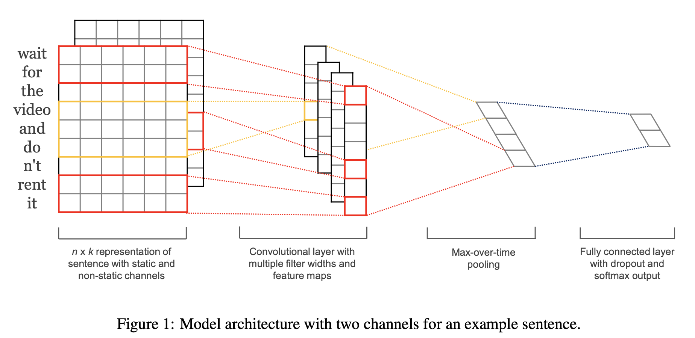

# Convolutional Neural Networks for Sentence Classification

### TL;DR

* This paper used convolutional neural networks to do the classification on sentence 
* Two input channels are used, both of which are initialized with Word2Vec, but one is fixed and the other is fine-tuned during training
* One-layer 1D CNN uses multiple resolution to capture different word level N-grams in sentences 
* The result suggests that pretrained word vectors and fine-tuning can improve the qualifity of the final word representation and the classification accuracy, but the result of multi-channel input are mixed due to lack of regularization of fine-tuning

### Model

* Preprocessing:  (1) for the word not appearing in the word2vec, the paper initializes the word vector randomly using uniform distribution of similar variance in the original word2vec. (2) Since the length of sentences in a minibatch is not the same, just pad them to the same length using zeros. 
* Inputs: two channels of word vectors for each word, both of which are initialized with word2vec, but one is fixed and the other is fine-tuning based on specific tasks during training. The author originally tends to use the static vectors to make sure fine-tuned ones will deviate far from the pretrained ones.  
* CNN: the paper uses multi-resolution CNN to capture different N-grams information in sentences. In the paper, they use (1) 3 resolutions with [kernel size = 3, 4, 5, stride=1, filter maps for each kernel = 100] (2) temporal maxpooling, which picks up the maximum value along sentence axis. Note this maxpooling is to solve the problem that different sentences have different length but the input for fully connected layer needs to be fixed.
* Regularization: (1) dropout on fully connected layers (2) L2 constraint on model weights $\|w\| = min(s, \|w\|)$, where $s=3$ in the paper 

### Conclusion

* The model outperforms previous sentence classification models on 4 out of 7 datasets
* Pretrained word vectors can capture "universal" information of words, and fine-tuning using specific tasks can further improve the quality of them and the final classification result.
* Multichanneled input have a mixed results w.r.t the classification accuracy. The possible reason is that further regularization is needed to guarantee that the fine-tuning word vectors are not far away from the original pretrained ones.