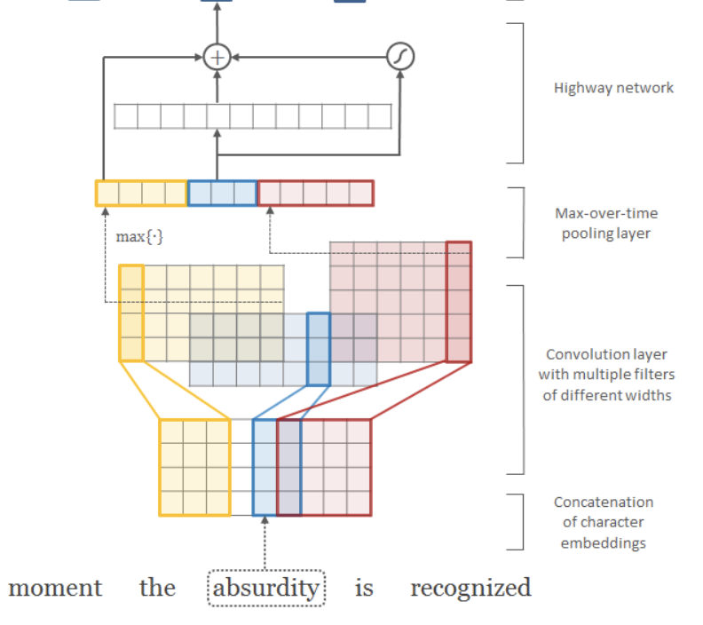
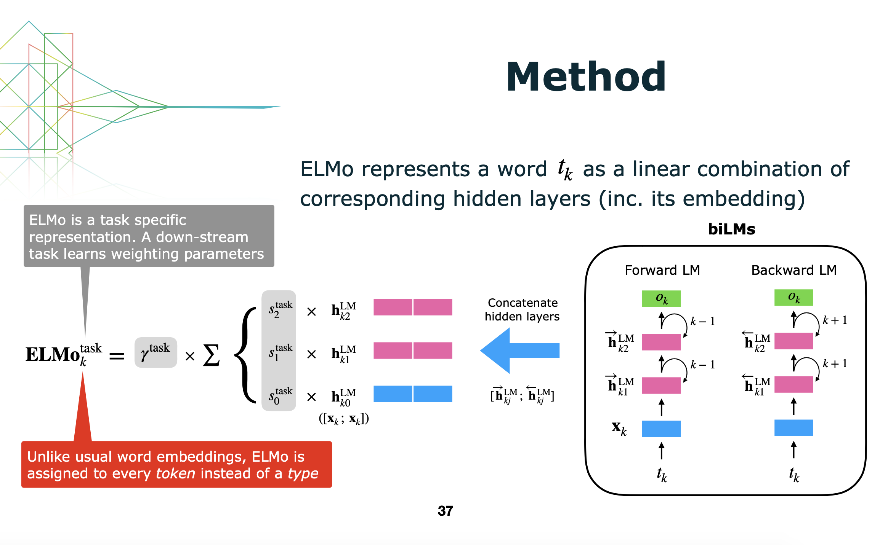

# Deep contextualized word representations

### TL;DR

* Traditional word vector lacks context information and CoVe igores the internal information in BiLSTM
* ELMo uses two 2-layer LSTM, one is forward another is backward, to capture the context, and concatenate the hidden from each LSTM and character-level word embedding in order to use all level information
* ELMo is able to captures "deep" context for each word, which can encode semantic and syntacitic information very well and it verifies top layer representation encodes sematic meaning better while lower layer encodes sytactic mearning better

### Motivation

* Traditional word vector is assigned to each word, although it contains some information in the context window, it does not encompass all sentence meanining and word order. 
* Context vector like CoVe only takes the representation from LSTM top layers, which may ignore different level information captured in LSTM. It is previously shown that different LSTM can capture different linguistic information.

### Model

* The overall architecture includes three parts: character-level CNN, Bidirectional Language model, CNN softmax.

* Character-level CNN: 

  * This is the same as in this [paper](https://arxiv.org/pdf/1508.06615.pdf) and this [paper](https://arxiv.org/pdf/1602.02410.pdf)

  * Each character has the corresponding embedding, and multi-resolution CNN, which are proposed in this [paper](https://www.aclweb.org/anthology/D14-1181.pdf), is applied on it to extract the fixed-length feature for all words

  * After it, [Highway network](https://arxiv.org/pdf/1505.00387.pdf) is used to extract more abstract information. Highway network is inspired by LSTM to add a gate to linear layer. But [ResNet paper](https://arxiv.org/pdf/1512.03385.pdf) points out that Highway network cannot deepen network more than 100 layers.  So maybe using Residual block is better here. 

  * The output from Highway net is the word embedding. The whole architecture is as follows:

    

* Bidirectional LM:

  * To capture the context information from both sides, the paper uses two LSTM, one forward, one backward, both of which have two layers to get multi-level information. Note there is shortcut connection between each LSTM layer, input char embedding, char-CNN and softmax parameters are shared between two directions.
  * To train the Bidirectional LM, the paper trained it to predict the next word given previous several words. (For backward LSTM, predicts $w_{i}$, given $w_{i+1}\ldots w_{T}$). And the loss function is the summation of both directions. 
  * Once it is trained, we can use two LSTM as encoders, and concatenate word embedding from char-level CNN and hidden states from each LSTM layer (L=2 as in the paper), which is $[x_{k};h_{k}^{1};h_{k}^{2}]$, where $h_{k}^{l} = [\overrightarrow{h_{k}^{l}}, \overleftarrow{h_{k}^{l}}]$. Therefore, ELMo contains different level information. In the downstream task, $ELMo_{k}^{task} = \gamma^{task}\sum_{l=0}^{L}s_{l}^{task}h_{k}^{l}$, where $\gamma$ is the parameter for optimization and $s_{l}^{task}$ is the softmax weight for each layers' representation and are learnt using the downstream task. Note that $h_{k}^{l=0}=x_{k}$.

* CNN softmax:

  * The paper did not compute Softmax directly, instead, it gives each character an output embedding, which is different from input embedding, and use the same char-CNN architecture to compute the word vector. 
  * Since the word vector computed from char-CNN is smooth, which leads to the problems that words with similar spellings but different meanings are given the similar vector, CNN softmax fixes this by assigning each word a low-dim correction vector and learning a projection matrix to transfer it to the output embedding dimension. The final output word embedding is $CNN(char s_{w})+W \times corr_{w}$.
  * Then use word vectors of every words to inner product the context vector obtained from LSTM, and compute softmax according to inner products to select the word with highest probability as the prediction. 
  * Once the output character embedding and CNN are trained, in testing, we can fix them and compute each word vector beforehand

* Test time:

  * Once the model is trained on the LM tasks, it can be transfered to a new task. 
  * When transferred, we freeze input char embedding, input char CNN and LSTM parameters and extract word embedding and hidden states from each LSTM layer. Then use new task to learn how to combine each layer's information together i.e. learn $\gamma$ and $s$.
  * Once combination are learnt, ELMo vector can substitite the original word vector to be fed into the task network.

* The overall architecture is as follows (copied from [here](https://www.slideshare.net/shuntaroy/a-review-of-deep-contextualized-word-representations-peters-2018))

  

  * Note ELMo is assigned to every token instead of a type, since the same token has different meaning under different context.

### Conclusion

* ELMo can encode semantics and syntax very well which improves 6 downsteam tasks SOTA result
* Lower LSTM can encode syntax better, while semantics can be better captured by the higher LSTM layer 
* ELMo vector can differentiate the same word within different context, which is especially useful for words with different meanings.