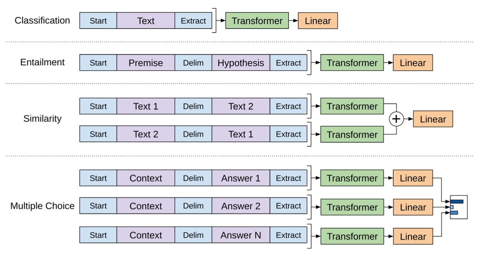

# Improving Language Understanding by Generative Pre-Training

### TL;DR

* GPT is using pretrained generative model (Transformer decoder) to fine-tune on the discriminative tasks
* Generative model is pretrained on language modeling task
* Fine-tune the generative model combined with learning language modeling on target dataset will improve SOTA results  9 out of 12 transferred tasks 

### Model

* GPT has two steps: pretrained on language modeling task and fine-tuned on several supervised tasks

* Instead of using LSTM, the paper uses the decoder of Transformer, which is naturally language model and generator 

* Pretraining

  * pretrain task is still language modeling tasks $P(w_i|w_{i-k},\ldots,w_{i-1})$
  * Different from the decoder used in the Transformer paper for translation, since there is no source sentence, decoder has no "encoder-decoder attention layer" and only has "masked self-attention layer" and "positional-wise feed foward layer" 
  * At each step, the decoder self-attention layer which uses query vector q of the last generated word $w_{i-1}$ and key K and value V from context $w_{i-k},\ldots,w_{i-2}$ ( words having been generated already before the last word) and positional FFN are used to get a single vector for the predicted word. Then linear layer, output embedding and softmax are used to compute the probability for the next word. Note in this paper, the input and output embedding share the same matrix

* Fine-tuning

  * When fine-tuned with supervised tasks, the paper apply the pretrained Transfermor decoder on the input sequence and uses the last hidden states $h_{N}$ to compute softmax probability for the label

  * The paper also claims that axillury task of learning language model on the target task while trained on the supervised tasks can also improve the final performance. I think the reason is that the model will also be trained to adapt to the distribution of the new dataset. In inference, the model will remove this language modeling task. 

  * To adapt the same model architecture to different form supervised tasks, the paper concanate different parts in the target task very smartly as follows

     

### Conclusion

* GPT improves SOTA results for 9 out 12 supervised tasks
* The more layers have been transferred, the higher performance the model has. It means different layer of the pretrained model contain different level information for the target tasks
* The large dataset can greatly benefit from auxiliary task when fine-tuning, while small ones do not. I think the reason is the same as CS224N note points out for fine-tuning pretrained word vectors like GloVe, which is the smaller dataset has no enough data to enable the model to learn the information as general as possible, and this will lose the advantage of pretraining 
* Transformer performs better than LSTM, which demonstrates that Transformer is a more powerful feature extractor
* Directly training Transformer on the supervised tasks will drop performance compared to pretraining, which indicates the importance of pretraining

### Comment

* Borrow the idea from ELMo, is it much better if using BiLM instead of unidirectional LM?