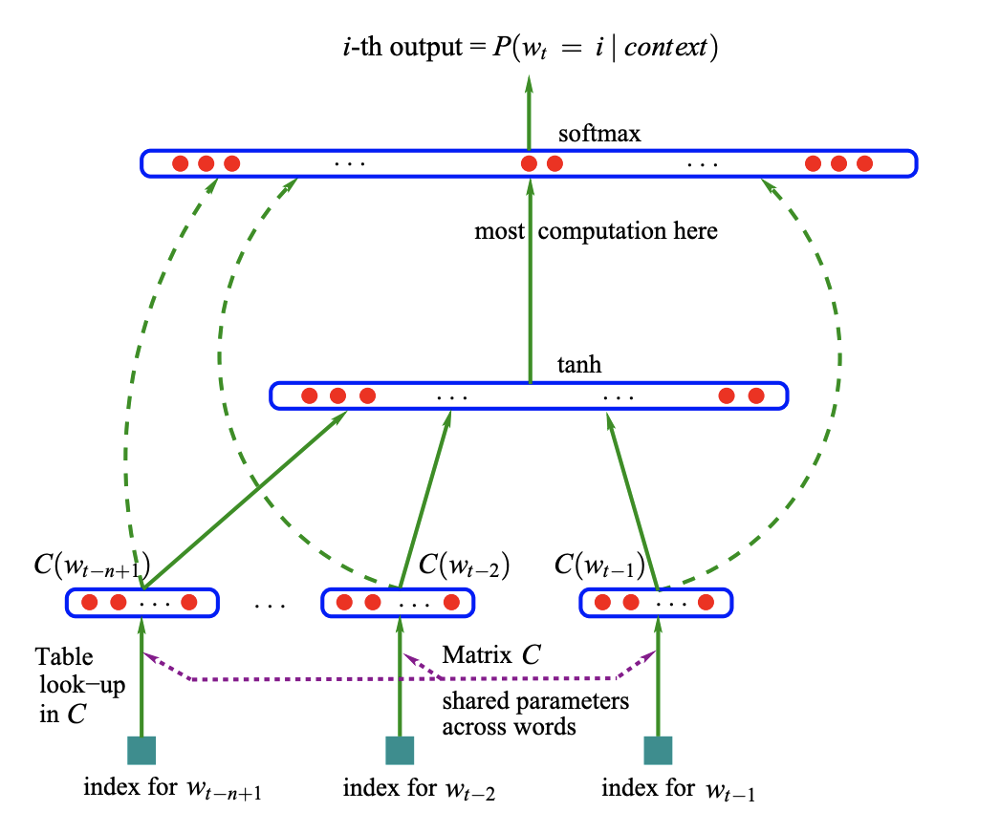

# A Neural Probabilistic Language Model 

###TL;DR

* First paper to use neural networks to implement language model
* Embed each word with a feature vector and construct a lookup embedding matrix to store them. 
* Use a MLP to compute next word given n-1 preceding words (n-gram)

### Hypothesis

* Distribution representation: a word's meaning is represented by the context words around it. 
* Word similarity: similar words should have similar representation, when computing the joint probability for language model, substitute a word with a similar word will not change the probability too much. 

### Dataset and Preprocessing

* Dataset: Brown Corpus (English texts and books), Associated Press (AP) News
* Stemming
* Keep only frequent words, and map rare words (<=3) to a special symbol
* mapping numeric forms to special symbols, mapping rare words to a special symbol and mapping proper nouns to another special symbol

### Model

### Conclusion

