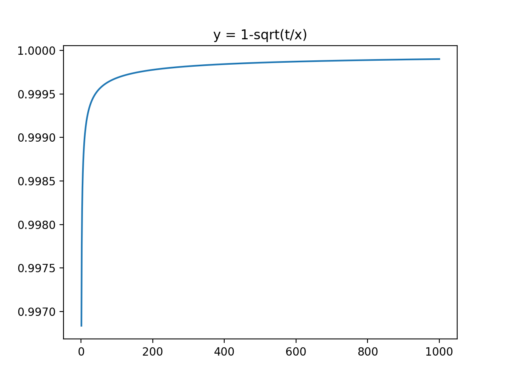

# Distributed Representations of Words and Phrases and their Compositionality

### TL;DR

* This paper is the second part of Word2Vec series, proposing to use Hierarchical Softmax and Negative Sampling for combat the computational expense of softmax. 
* Hierarchical Softmax uses Huffman binary tree to reduce the complexity from $|V|$ to $log|V|$.
* Negative sampling changes the objective function for Skip-gram by making the model to differentiate the one word-context pair from the corpus and k pairs not from the corpus. 
* Negative sampling will improve the representation quality for frequent words.
* Subsampling frequent words will benefit the rare word representation.
* Word2Vec does a great job on phrase representation.
* Word vectors from the paper has addictive property as well.

### Hierarchical Softmax

* Hierarchical Softmax can reduce the computational complexity from $|V|$ to $log|V|$ by formalizing a tree.
* The paper used the Huffman tree whose leaves are output/context words. Huffman tree has the average shortest representation length for each word. 
* Skip-gram model with hierarchical softmax still has a word vector for each input/center word, but for output/context words, it puts them into leaves of a binary tree, and associate each **inner** node a vector. 
* The binary tree used sigmoid for the left and right child path at each inner node to guarantee the probability for all context words given the center word is 1. 
* Each time using sigmoid to compute the probability at each inner node, the model computes the inner product of the input/center word vector and that node vector as "z" in sigmoid function. 

### Negative Sampling

* Another way to approximate Softmax. 
* Negative sampling change the objective function from a softmax into a sigmoid to differentiate the pair $(w_{center}, w_{context})$ where context is in the neighborhood of the center word and k pairs where context is not in the neighborhood by sampling the context word from the corpus using 3/4 power of unigram probability (after it, note to re-normalize the probability making the sum of probability as one again).
* Instead of updating all output/context word embedding matrix as backpropagation, negative sampling only updates the center word input embedding and selected k context word vectors, which saves a lot of time to train the whole model.
* k = 10 is an optimal choice, which is gained from GloVe paper.
* It turns out that negative sampling can improve the accuracy of frequent word representation. 

### Subsampling frequent words

* To combat the imbalance between frequent and rare words to avoid the case that not so meaningful pairs like with "the", "a", "it" dominate, the paper discards each words in the training data by the probability of $p(w_{i}) = 1-\sqrt{\frac{t}{f(w_{i})}}$, where t is a threshold whose value was empirically chosen as $10^{-5}$, and $f(w_{i})$ is the frequence of word $w_{i}$.

* The probability penalizes the frequent word greatly compared to the rare words (the function as shown below), which improve the quality of rare word representation.

  ​                                                      

### Learning phrases

* Skip-gram model can also be applied to learning representation for phrases, the method is the same as for words but treats the phrase itself as a token and gives it a single vector representation.
*  Phrases are formed based on the unigram and bigram counts by $score(w_{i}, w_{j}) = \frac{count(w_{i}, w_{j})-\delta}{count(w_{i})\times count(w_{j}))}$, and the bigram with the score above the threshold is considered as a phrase.
* The evaluation metrics is also the same as words.

### Additive property 

* like subtractive property stated in the first paper of word2vec, the word representation also has the additive property, e.g. vector(Russian) + vector(river) = vector(Volga River).

### Conclusion

* Negative sampling can greatly improve the total accuracy (syntactic+semantic)/2 of Skip-gram.
* Subsampling for frequent words will not hurt the total accuracy, and will greatly decrease the training time. 
* For negative sampling, larger k has better performance, with the trade-off for training time. 
* For phrase representation, Hierachical Softmax with frequent word subsampling achieves the best result. 