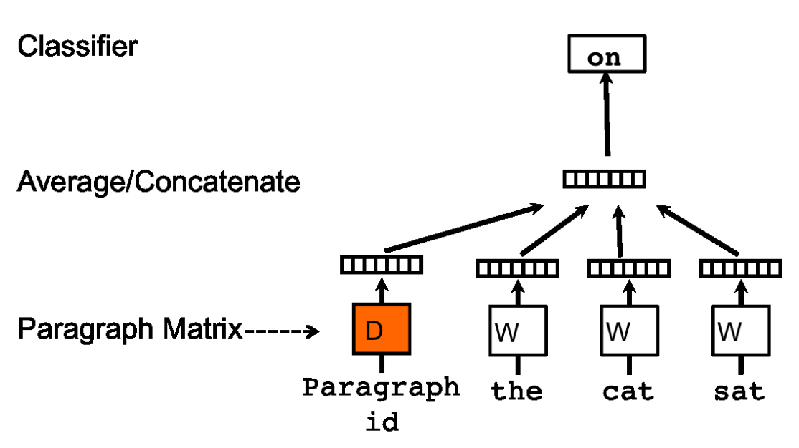
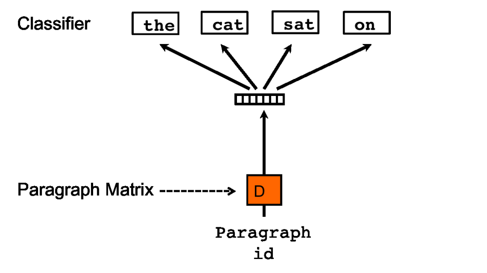

# Distributed Representations of Sentences and Documents

### TL;DR

* This paper resort to ideas in Word2Vec, trying to get the distributed representations for the higher granularity (lets say paragraph here)
* PV-DM: use the concatenation of paragraph vector and  word vectors to predict what is the next word given a context window inside it
* PV-DBOW: use paragraph representation to predict words insides itself
* The paper uses the text classification task to empirically evaluate how good this representation for this specific task

### Model

* Bag-of-word for text classification has two drawbacks: 1. it ignores the word order which may provide extra information for text classification, 2. it cannot represent semantic meaning between words

* Distributed Memory Model of Paragraph Vectors (PV-DM):

  

  * Each paragraph has a unique vector, so does each word
  * Like Word2vec, the paper also uses a sliding window inside a paragraph **itself** to get the context window. 
  * The scheme is to predict N-th word based on the paragraph vector and preceding N-1 words (like NNLM, instead of CBOW). The paragraph may provide missing information apart from those in context words.
  * Unlike CBOW, the input length of words for PV-DM is the same, since authors found that concatenation can preserve the order information and achieves better result. 
  * Train time: use SGD to train both paragraph and word vectors. Inference time: fix all parameters in the model and only use SGD to update paragraph vectors in the test set. It needs to go throught the same process as in train time. 

* Distributed Bag of Words version of Paragraph Vector (PV-DBOW):

  

  * The architecture is similar to Skip-gram, which is to predict randomly selected words in a paragraph based only on the paragraph vector. Note, there is no context window here.

    

* After obtaining the paragraph vector, it is sent into a classifier such as a logistic regression model to do the text classification task.

### Conclusion

* Using pharagraph vector can improve the taxt classification accuracy compared to all previous works
* PV-DM is better than PV-DBOW, but when it is concatenated with PV-DBOW together, the text classfication accuracy is even higher. 
* Vector concatenation can preserve the order information, so the performance of concatenation of vectors is better than average.

### Comment

* This paper specifically train paragraph vectors for the text classification tasks. However, different from previous works about word vectors, this paper does not use any metric to evaluate the representation ability (such as semantics and syntax) of word and paragraph vectors. So I think this is the question the paper can dig deeper.
* I don't think one vector can represent a paragraph comprehensively only from simple "pack-up" mothods. Future work maybe include how to utilize the hierarchical structure of languages (words --> sentence --> paragraph --> document) to make representation more complete. 
* Actually, BOW model has one advantage if it is using TF-IDF: it can show which words are more important for the sentence. How to explore which word matters for represent a paragraph is worth discussing. 