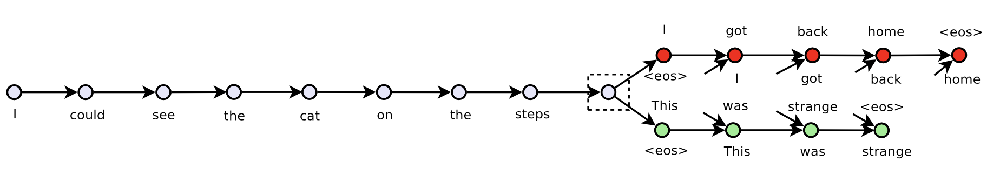

# Skip-Thought Vectors

### TL;DR

* This paper solves my questions in the comment part of Paragraph Vector paper
* Encoder-Decoder structure and sentence level skip-gram are used to learn sentence vector by predicting last sentence and next sentence
* The whole structure is also similar to machine translation, except that it will generate two sentences based on encoded sentence vector: last and next sentences 
* The paper explores the quality of sentence vector using metrics like in Word2vec paper and it turns out that skip-thought vector can capture the sentence structure and acchieve approxiamtely best performance on 8 tasks.
* The paper also uses linear mapping between word2vec and word vector learnt by encoder-decoder to extend vocabularies in the training corpus

### Model

* The paper applies Skip-gram idea on the sentence level, which is to predict the last and next sentence based on the current sentence. 
* The paper associate each word with a word vector which can be learnt during learning, and use an encoder to encode the current sentence and represent it as a sentence vector (the paper uses GRU as encoder, but others like CNN can also be used)
* Like Machine Translation, the paper use a decoder to generate the last and next sentence word by word. Note that the word vector are shared with all sentences. When using GRU as the decoder, the paper uses the sentence vector obtained from the encoder to modify the gate function, which is how they condition on the sentence vector.
* The loss function is like in machine translation, which is to compute cross-entropy loss on each generated word in the last and next sentences.
* Since the corpus for training sentence vectors has only 20,000 vocabularies, the idea in this [paper](https://arxiv.org/pdf/1309.4168.pdf) is applied. The paper found through PCA that same vocabularies (such as numbers) has the similar distribution on 2D plot, so they claimed that there should be a linear relationship between word spaces of different languages, and once the linear relationship is learnt according to some pairs in corresponding languages, the language with less vocabulary can obtain the missing word vector by mapping from the corresponding word vector in the other language using the learnt linear transformation. This paper uses the word vectors pretrained by Word2Vec paper, and obtained word vectors for missing words in the test set by getting the linear mapping from the corresponding Word2Vec pretrained word vector. 

### Conclusion

* The skip-thought sentence vector can capture the sentence structure and acchieve approximately or exactly SOTA results on eight tasks the paper designed to measure its representation ability.
* From sentence relatedness tasks, it seems that although the sentence vector can capture the sentence structure very well, but it cannot tell the difference if we change structure slightly and change some word to its negation.

### Comment

* It seems that the skip-gram can represent sentence structure very well, but once the sentence structure is the same, even if we change some word to its negation, the vector cannot tell the exact different between them. I think the reason maybe because that the vocabulary in the training set is so small, even if the missing word can be mapped from the general word vectors, the mapping may miss some semantic details.
* The paper used to mapping missing words assumes that different word vectors space of different languages has linear relationship through 2D PCA projection. But PCA may lose some semantic details, and the linear relationship maybe cannot capture this. Even if it can, it is still unclear whether vector space trained by Word2Vec and by RNN in this paper has linear relationship or not. Additional non-linear relationship may be needed to represent for this relation.  