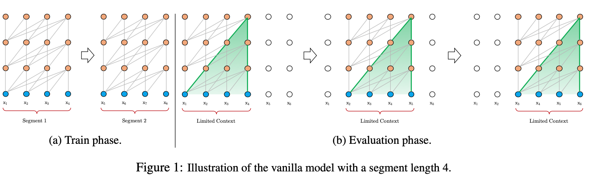
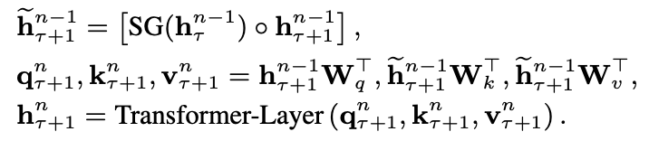
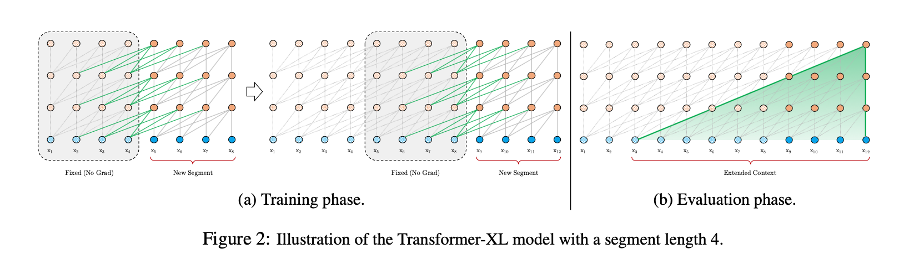
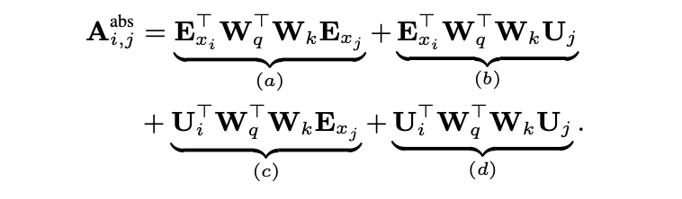
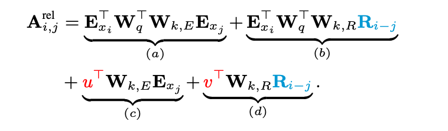
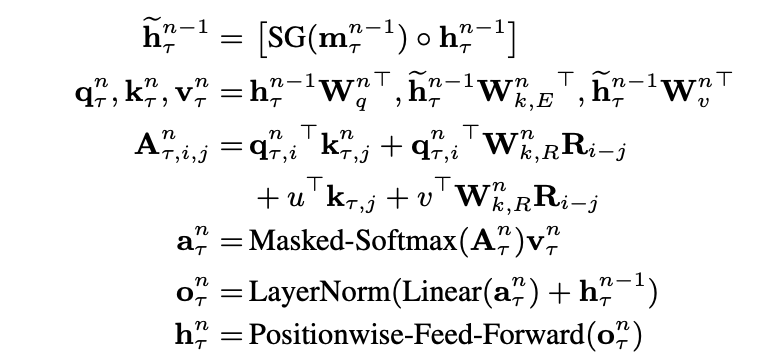

# Transformer-XL: Attentive Language Models Beyond a Fixed-Length Context

### TL;DR

* Vanilla Transformer cannot attend on very far context due to the computation requirement
* Transformer-XL proposes: (1) recurrent mechanism (2) relative position encoding to greately enlarge the context range which can be attended. 
* Transfomer-XL can capture 80% and 450% longer context dependency compared to RNN and vanilla Transformer. 

### Motivations

* Vanilla Transformer cannot attend on very long sequence due to the huge computation complexity, so how to take advantage of Transformer but extend the context is the key question of this paper.

* If chuck the whole sentence into segments and apply Transformer on each segment, there are two problems: 

  * Training: the current words can only attend on the current segment, which may lose some long-range dependency. Also, for the first several words of each segment, it will lose the context greately especially the context before it, the paper call this problem _context fragmentation_. 
  * Test: applying Transformer on each segment and then shifting one position and so on in the test time is very time-consuming, since it cannot memorize the previous result and need to apply Transformer inference N-1 times (assume we have N words in a document). 
  * Please see the following picture from the paper for better understanding:

  

### Architecture

* Recurrent mechanism:

  * Transformer-XL borrows the idea from RNN and uses Left-to-right LM as the task to train the parameters

  * First of all, when applying Tranformer on the previous segment, the result will be frozen and used for computing the current hidden states.

  * Then in the attention heads of the current segment, Transformer-XL still uses the query vector of the words from the current segment, but value and key vectors are from both the current and previous segment(s). 

  * Please note that higher layer is, larger range can be attended (If we want to train a LM using multilayer Transformer, we cannot only use attention mask, we need to mask on the input directly. Remember the question in CS685 midterm exam.). 

  * The formal way to indicate those steps is as follows:

    

  * The illustation is as follows:

    

  * We can definitely see that the actual attentional range extends a lot (green area).

* Relative positional encodings:

  * Motivation: if we do the absolute positional encoding, then the positional encoding of word $w_{i,\tau}$ in the previous segmentation $\tau$ is the same as the word $w_{i,\tau+1}$ in the current segmentation $\tau+1$, which cannot tell the different between them in attention heads. 

  * To solve the problem, the paper proposed relative positional encodings: use relative poisition to make the model be able to tell difference between words in the current and previous segments. It is enough for a word to know the relative position when it attends on other words. 

  * Absolute positional encoding: The paper first anatomized the attention score of absolute positional encodings as follows. When we do some linear algebra, we can see it is the expand of $(E_{i}+U_{i})^{T}W_{q}^{T}W_{k}(E_{j}+U_{j})$, which is equivalent to $q_{i}^{T}k_{j}$. The paper also gives the explanation for each of four parts: 1. based on the content of word $w_{i}$, how much should it attend on the (a) content and (b) position of the word $w_{j}$.  2. based on the position of word $w_{i}$, how much should it attend on the (c) content and (d) position of the word $w_{j}$. The anatomy shows the attention score actually capture both syntax/position and semantic/content information.

    ​                                         

  * Relational positional encoding: compared to absolute one, the paper does several motifications: (1) replace the absolute positional encoding $U_{j}$ with the relative positional encoding $R_{i-j}$, which is also denoted using sinusoid matrix as the original Transformer paper. (2) replace $U_{i}W_{q}$ w.r.t the content vector $E_{x_{j}}$ as a **trainable** vector $u$, and $v$ for the relative positional encoding $R_{i-j}$. Note that since $i-j$ can be known before training, so we can compute $R_{i-j}$ beforehand (3) intentionally differentiate matrices $W_{k,R}$ and $W_{k,E}$.  

    

  * The overall math for layer $n$ is:

    ​                                            

    

### Comment:

* If we don't need to attend on such a long sequence, we can also use this method to make the model able to attend on the external knowledge which plays the same role as hidden states of the last segment. 