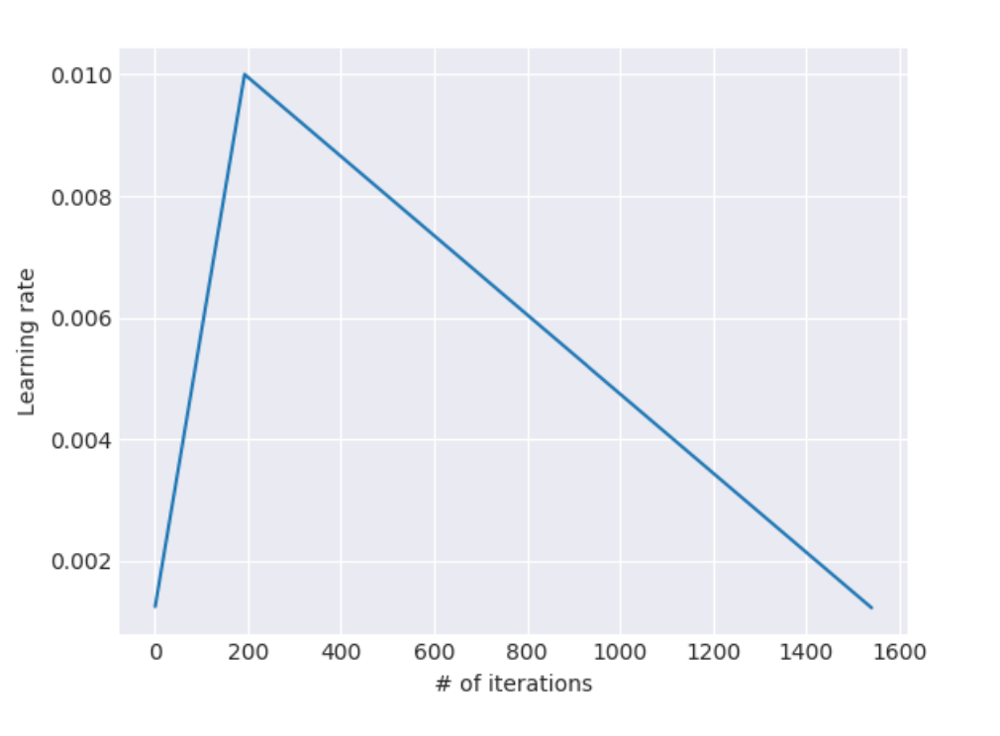

# Universal Language Model Fine-tuning for Text Classification

This paper does not introduce fancy language models, instead, it gives us several transfer learning methods, which can be applied to any neural language models. Note that this paper only demonstrates its feasibility on text classification tasks. For other more complicated tasks, e.g. question answering, it may needs more complex transfer learning methods. 

* The paper uses the same model in this [paper](https://arxiv.org/pdf/1708.02182.pdf) and also applies BiLM mentioned in ELMo paper

* The transfer learning process includes three steps: Pretrain LM, Fine-tune LM, Fine-tune classifier

* Pretrain LM

  * Like other transfer learning methods, the paper first pretrain the LSTM model on the task of language modeling, with a large corpus, Wikitext-103, to capture the word and document meaning as general as possible

* Fine-tune LM

  * For the downstream tasks, such as text classification, the paper first needs to fine-tune the whole LSTM model on the task corpus since the distribution between it and the general dataset is probably different

  * Discriminative fine-tuning

    * Like in CV, different layers encodes different level information, and they needs to be fine-tune to different extend, therefore, the paper uses different learning rates to different layers to the language model
    * From the upper layer to the lower layer, the learning rate is decreasing, which obeys $\eta^{l-1}=\frac{\eta^{l}}{2.6}$

  * Slanted triangular learning rates

    * Discriminative fine-tuning applies to different layers, while slanted trangular learning rates applies to the whole model

    * The intuition is that the model needs to first adapt to the new latent parameter space from a new corpus quickly, and then refine its parameters util converage. An example of learning rate is as follows:

      

* Fine-tune classifier

  * Since the target task is text classification, after learning a LM, a classifier must be learnt from scratch for the classfication task
  * Concat pooling
    * For text classification, the key words which make big difference for the final result may scatter in each part of a text, so only classifying the text based on the final hidden state is not enough for this task. 
    * To combat this, the paper concatenate the last LSTM hidden state, the max and mean pooling of all the hidden states in the text. 
  * Gradual unfreezing (I think this should be at LM Fine-tune part, but the paper states it under classifier Fine-tuning section)
    * The paper points out that to fine tune the classifier, one must be concious about the learning rate: if the learning rate is too high, then the model will forget about the pretrained information very quickly, making pretraining useless; if too slow, the model will take longer to train and easy to overfit
    * Gradual unfreezing is similar to Discriminative fine-tuning, which also fine-tunes different layer differently. Gradual unfreezing first freeze all parameters, unfreeze the highest and least general layer and learn it for one epoch. Then unfreeze one lower layer (now two layers is unfrozen) then train them for another epoch. Repeat this procedure until all layers have been unfroze and the learning is converged

* Conclusions

  * Effectiveness: ULMFiT improves SOTA performance on six text classification tasks
  * Robustness: using transfer learning from a more general corpus is more robust than learning from scratch. Also fine-tuning on the same dataset with more sample performs even more robustly than with smaller samples. The paper shows that the model using ULMFiT performs very well even with 100 target examples to fine-tune the Language model.

  