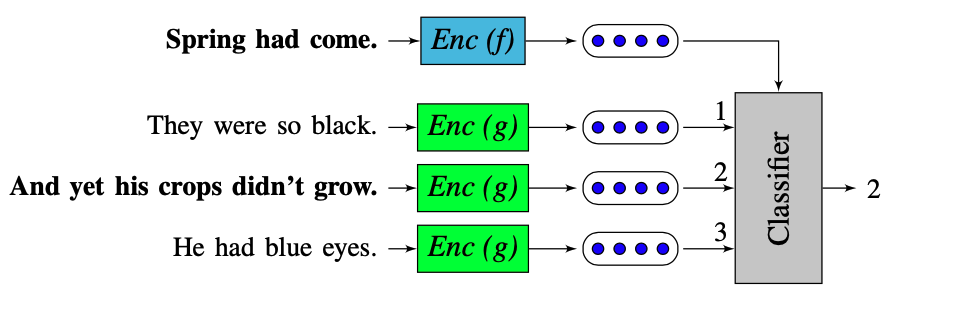

# An Efficient Framework for Learning Sentence Representations

* Skip-thought vector forces the model to learn not only the semantics, but also some other irrelated things
* This paper is sentence version of Skip-gram with Negative sampling
* Different from Skip-thought vector, this paper uses the discriminative model instead of generative model, so that it can capture the semantics of sentences better without forcing the model to learn the exact form of sentences and is more robust to sentence sturcture change.
* Like Negative sampling, it is much faster to train this model.
* RNN is used as encoder, when the training is finished, the pretrained encoder can be used to encode unseen sentence to get sentence vectors
* This is all about this simple model which indicates that Language is hierarchical, the idea on one level can be easily transfered to other levels.