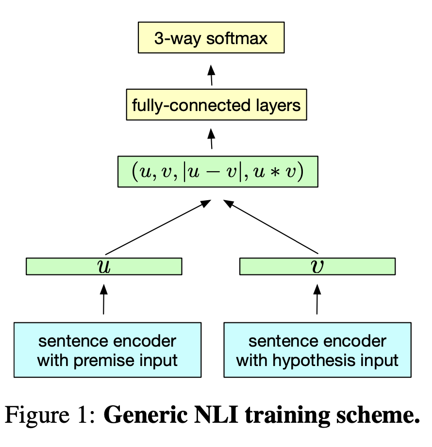

# Transfer Learning in Sentence Representation

This notes is for two papers I have read at first time talking about transfer learning in sentence representation sysmatically. Although their models are not very innovative, their idea of how to use generate general sentence encoder and evaluate them is pricessless, which may inspire the succeeding language models. From those two papers, I think the era of NLP ImageNet has come.

* [Supervised Learning of Universal Sentence Representations from Natural Language Inference Data](https://arxiv.org/pdf/1705.02364.pdf)

* [Learning General Purpose Distributed Sentence Representations via Large Scale Multi-task Learning](https://arxiv.org/pdf/1804.00079.pdf)

Unlike previous works which use unsupervised learning to train the sentence representation, the first paper finds that unsupervised learning make it harder for the model to generalize, while supervised learning can make better and more general sentence representation. 

* This paper assumes that NLI tasks can enable encoders to learn a more general sentence representation in a supervised setting

* It first trains a encoder on this task using the following architecture. Then to evaluate the generalization of the sentence encoder,the representation is tested on 12 classification tasks which are different from the one for the training, by fixing encoder's parameters and only using a very simple classifier (e.g. logistic regression).

  

* The result shows that the representation can achieve the similar result of those supervised models trained from scratch on those tasks. Which indicates that the generalization of the sentence representation. 

Based on the first paper, the second paper extends the idea of using single task to multi-task learning. It assumes that different tasks with distinct inductive biases can enable encoders to focus and encode different aspects of the same sentence and make it more generalize. 

* The paper selects skip-thoughts, machine translation, natural language inference, and constituency parsing tasks for training the encoder
* After each parameter updates, the paper randomly select a task with different their corresponding probability to continue to train
* The evaluation tasks are the same as the last paper. 
* The paper found that increasing training tasks will improve the transfer ability of the model, which proves that different tasks have different inductive biases. 
* It also shows that the transfered encoder is more robust when testing in a low-labelled setting, which makes it possible to use the pretrained encoder trained by large companies and fine-tune on our small tasks, which is like what has been done in Compute Vision. 